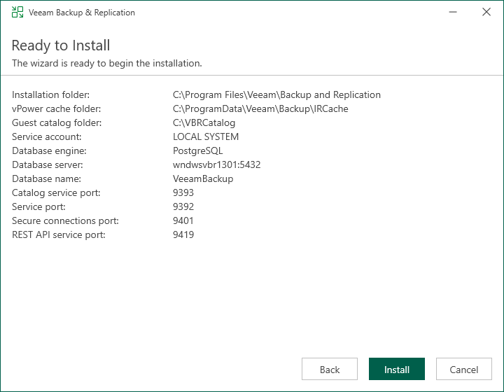

# Step 11. Begin Installation

The Ready to Install step of the wizard is available if you have selected to configure installation settings manually.

At this step of the wizard, you can review the Veeam Backup & Replication installation settings and start the installation process:

1. If you want Veeam Backup & Replication to check for product updates weekly, select the Check for product updates automatically check box. When a new product build is published on the Veeam update server, a notification will be displayed in the Windows Action Center.
2. Click Install to begin the installation.
3. Wait for the installation process to complete and click Finish to exit the setup wizard.

