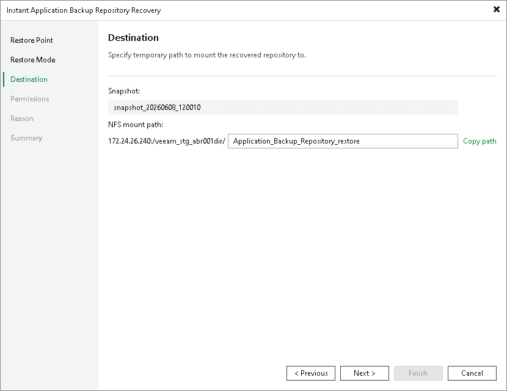

# Specifying Destination for Export Snapshot Option

At the Destination step of the wizard, review the selected snapshot and specify the mount path for the temporary NFS share in the NFS mount path field. The mount path must be different from the original NFS share path.

Click Copy path to save the full mount path to your clipboard and use it with your NFS client to access the temporary NFS share where the data is exported to.

Page updated 2026-06-17

