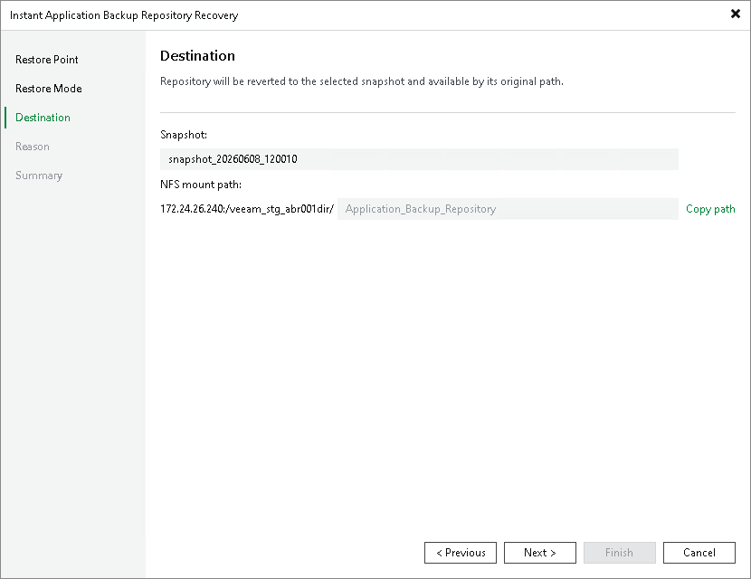

# Specifying Destination for Revert Snapshot Option

At the Destination step of the wizard, review the selected snapshot and the original NFS share path. Click Copy path to save the full mount path to your clipboard and use it with your NFS client to access the share after the snapshot revert operation is over.

Page updated 2026-06-17

