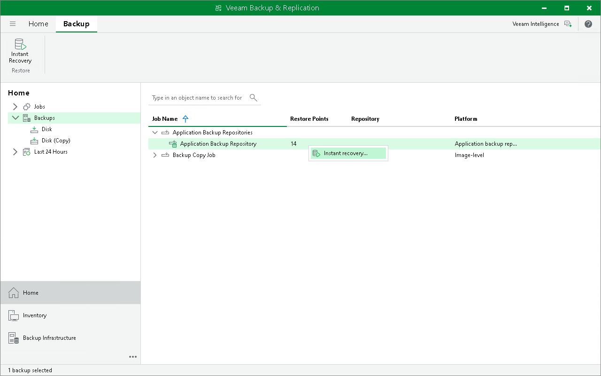

# Step 1. Launch Instant Application Backup Repository Recovery Wizard

To launch the Instant Application Backup Repository Recovery wizard, do the following:

1. Open the Home view.
2. In the inventory pane, select Backups.
3. In the working area, expand the Application Backup Repositories job, right-click the repository and select Instant recovery. Alternatively, you can click Instant Recovery on the ribbon.

You can perform the instant application backup repository recovery by using a backup copy. Backup copies created in the secondary repositories are represented in the Backups > Disk (Copy) node in the inventory pane. For more information, see [Performing Application Backup Repository Recovery from Backup Copy](abr_restore_bcj.md).

Page updated 2026-06-16

