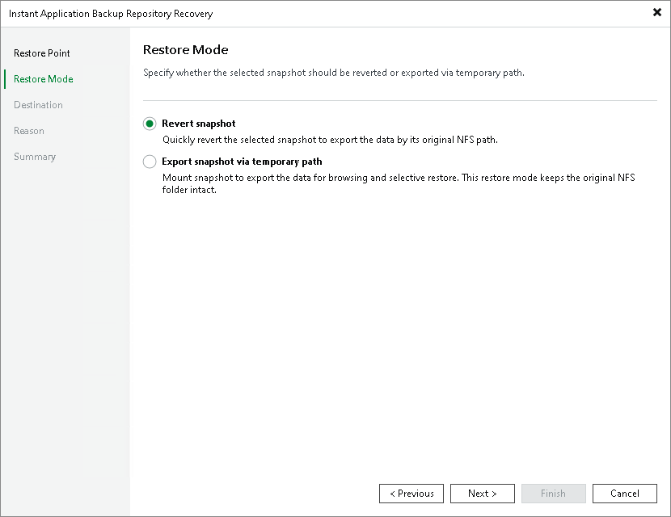

# Step 3. Select Restore Mode

At the Restore Mode step of the wizard, choose the necessary restore mode:

* Select Revert snapshot if you want to recover the application backup repository data to the original location. The snapshot will be exported by the original NFS path and available for read/write operations based on the original access permissions. The data of the original NFS folder will be overwritten.

|  |
| --- |
| Note |
| Reverting the application backup repository data does not delete any snapshots from the snapshot chain. Once the recovery session is over, all existing snapshots will be available as restore points. |

* Select Export snapshot via temporary path if you want to export the data to a temporary path for browsing and selective restore and leave the data in the original NFS folder intact. Veeam Backup & Replication will mount the selected snapshot to a temporary NFS share and make its data available for access.

If this option is selected, you will need to configure access permissions to the temporary NFS path at the Permissions step of the wizard.

Page updated 2026-06-18

