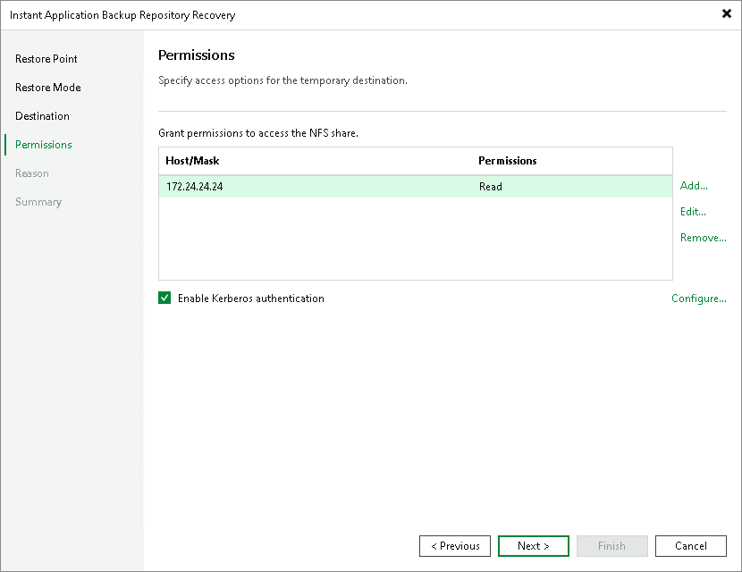
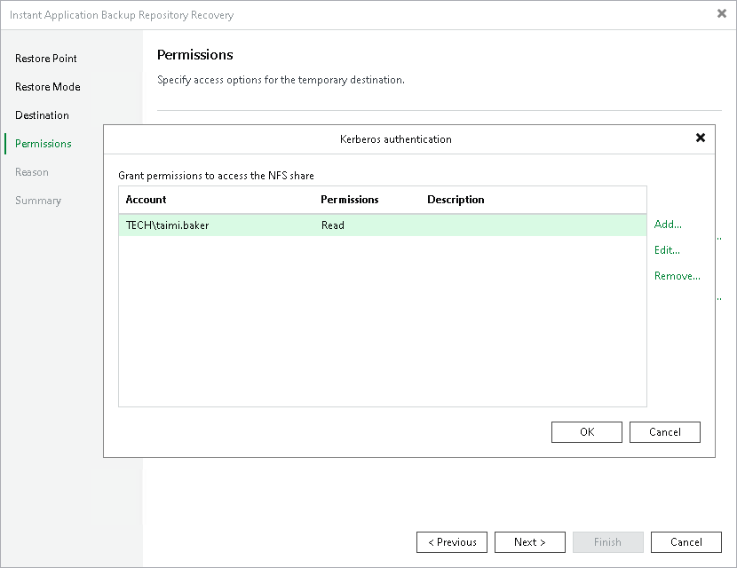

# Step 5. Specify Access Permissions

This step of the wizard is available if you selected the Export snapshot via temporary path option at the Restore Mode step of the wizard.

To be able to read data from the temporary NFS share, you must set up access permissions for specific hosts, IP masks or users with Kerberos authentication. By default, the access permissions are populated automatically based on the initial application backup repository configuration. You can edit them or add new permissions. For more information about requirements and limitations for access permissions and Kerberos authentication, see [Considerations and Limitations](abr_limitations.md#access).

|  |
| --- |
| Important |
| Any new data written to the temporary NFS share mounted for the restore operation will be deleted after the recovery session is over. |

To grant access permissions to a host or hosts under the IP mask:

1. Click Add next to the Grant permissions to access the NFS share table.
2. In the Add host or IP mask window, specify the hosts to whom you want to grant access permissions on the NFS share:

1. In the Host or IP mask field, enter the host DNS name or the subnet mask. You can enter the full DNS name or use a wildcard. For example, myhost.mydomain.com or \*.mydomain.com.
2. From the Permission list, select Read or Read/Write to define the scope of permissions given to the host.

To configure permissions based on the standard Windows Kerberos authentication protocol:

1. Check the Enable Kerberos authentication check box.
2. In the Kerberos authentication window, specify the user accounts or Active Directory groups to whom you want to grant access permissions on the NFS share:

1. Click Add next to the Grant permissions to access the NFS share table.
2. In the Username field, enter a user name for the account that you want to add. Specify the user name in the username@domain format. You can also click Browse to select an existing user account.
3. From the Permission list, select Read or Read/Write to define the scope of permissions given to the user account.

|  |
| --- |
| Note |
| The user account or group you use for Kerberos authentication must be resolvable from both the backup server host and the application backup repository host via the same Active Directory or Kerberos realm, or via a trusted realm or domain. |

Page updated 2026-07-28

