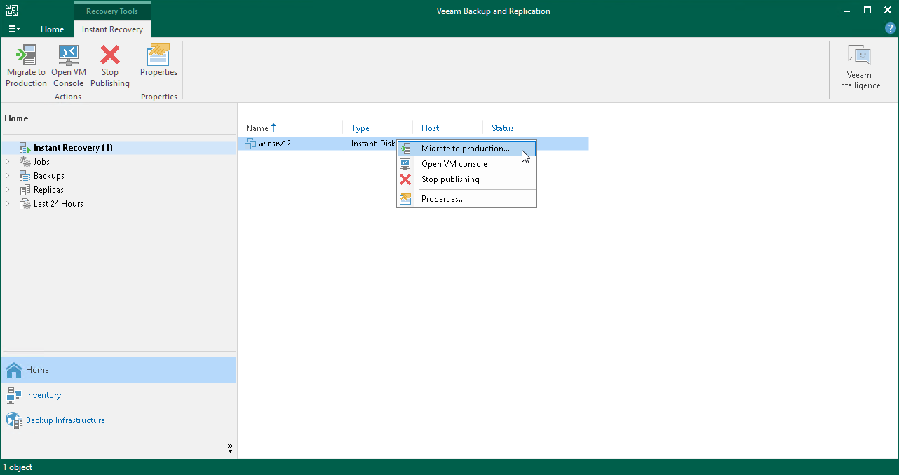
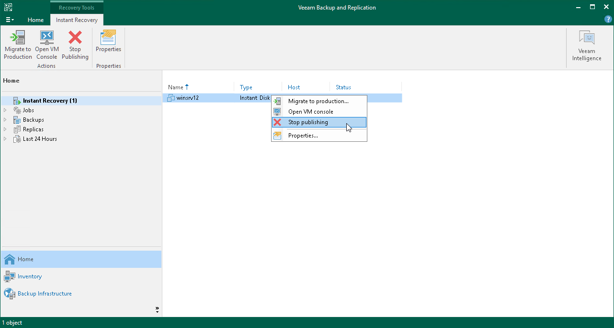

# Finalizing Instant Disk Recovery

After the disks have been successfully recovered, you must finalize the process. For this, test the recovered disks and decide whether to migrate them to production environment or stop publishing them.

Testing Recovered VM Disks

To test the recovered disks before you migrate them to production, you can launch from the Veeam Backup & Replication console the VMware Remote Console software of the VM to which the disks were recovered.

|  |
| --- |
| Important |
| Before you launch VMware Remote Console, make sure that this software is installed on the machine where the Veeam Backup & Replication console runs. |

To open a VM console in Veeam Backup & Replication:

1. Open the Home view.
2. In the inventory pane, select the Instant Recovery node.
3. In the working area, right-click a VM and select Open VM console.

Migrating Recovered VM Disks

To migrate recovered disks to the production environment:

1. Open the Home view.
2. In the inventory pane, select the Instant Recovery node.
3. In the working area, right-click the VM to which disks were recovered and select Migrate to production. Veeam Backup & Replication will launch the [Quick Migration](migration_job.md) wizard.

The wizard will be opened on the Destination step. At this step, you can change the datastore where the virtual disks will be placed. By default, Veeam Backup & Replication places the disks in the datastore where the VM configuration file is stored.

Other fields (host, resource pool and VM folder) are populated with data of the VM where you restore the disks. You cannot change this data.

After you finish working with the wizard, Veeam Backup & Replication migrates the disks with all changes made after the disk recovery and before its migration.

Stop Publishing Recovered VM Disks

If your tests have failed, you can stop publishing the recovered disks. This will remove the recovered disks from the VM that you selected as the destination for recovery. Note that all changes made to the recovered disks will be lost.

To remove the recovered disks:

1. Open the Home view.
2. In the inventory pane, select the Instant Recovery node.
3. In the working area, right-click the VM to which the disks were recovered and select Stop publishing.

