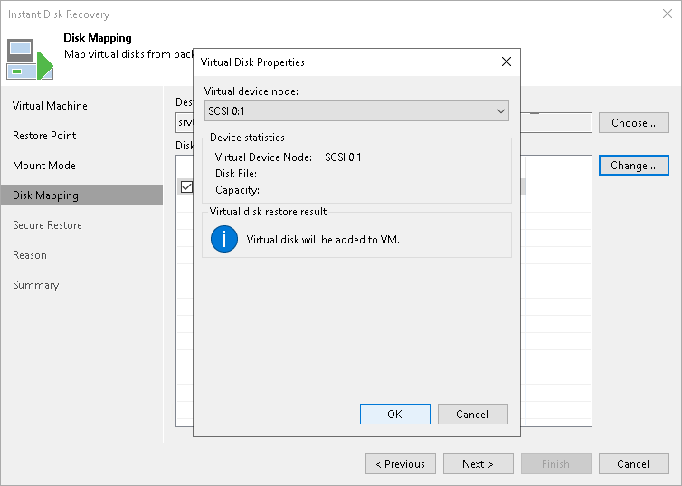

# Step 5. Select Virtual Disks to Restore

At the Disk Mapping step, select virtual disks that you want to restore and choose a VM to which the disks must be attached:

1. By default, Veeam Backup & Replication maps the recovered disks to the original VM. If the original VM was relocated or if you want to attach disks to another VM, select a target VM. For this, click Choose and select a VM from the virtual environment.

|  |
| --- |
| Important |
| Do not use the backup server or a VM where the vPower NFS Service is installed as a target VM. |

1. In the Disk mapping section, select virtual disks that you want to restore.
2. To change a virtual device node where a virtual disk will be restored, select a disk in the Disk mapping list and click Change. In the Virtual Disk Properties window, select the node:

* If you want to replace an existing virtual disk, select an occupied virtual node. The original disk will be deleted.
* If you want to attach the restored disk to the VM as a new drive, select a node that is not occupied yet.

|  |
| --- |
| Note |
| If you restore a virtual disk to an unoccupied node, Veeam Backup & Replication restores the disk in the offline state. To work with it, you need to bring the disk online. |

