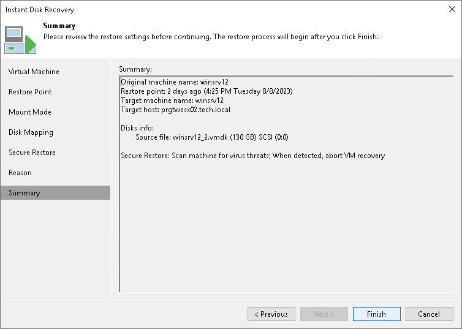

# Step 8. Verify Recovery Settings

In this article

At the Summary step of the wizard, check settings of Instant Disk Recovery and click Finish.

What You Do Next

[Finalizing Instant Disk Recovery](instant_disk_recovery_finalize.md)

Page updated 1/25/2024

Page content applies to build 13.0.1.1071
