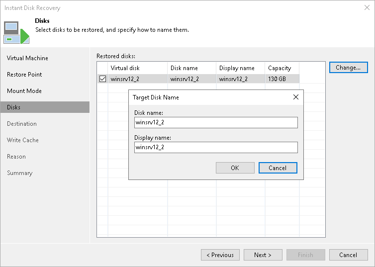

# Step 5. Select Virtual Disks to Restore

In this article

At the Disks step of the wizard, select virtual disks that you register as FCDs and define names for the recovered disks and FCDs.

1. Select check boxes next to virtual disks that you want to register as FCDs.
2. By default, Veeam Backup & Replication recovers disks and registers FCDs under the original disk names. To specify new names, select a disk and click Change. In the Target Disk Name window, do the following:

1. In the Disk name field, specify a name under which the disk will be recovered.
2. In the Display name field, specify a name under which FCD will be registered on the cluster.

Related Topics

[How Instant FCD Recovery Works](instant_disk_recovery_fcd.md#hiw)

Page updated 1/25/2024

Page content applies to build 13.0.1.1071
