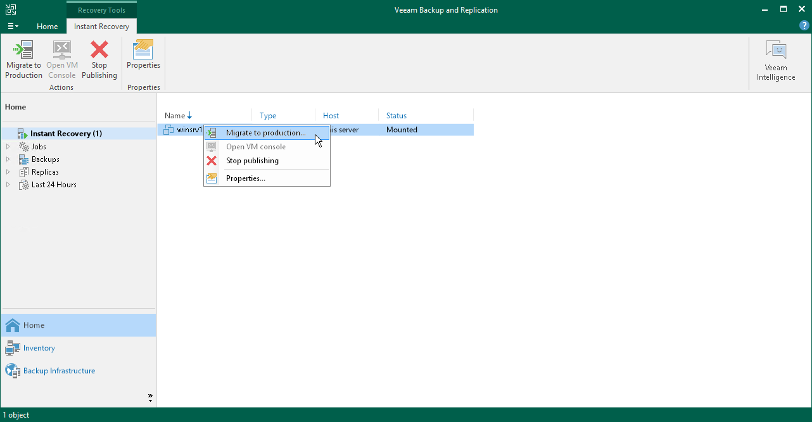
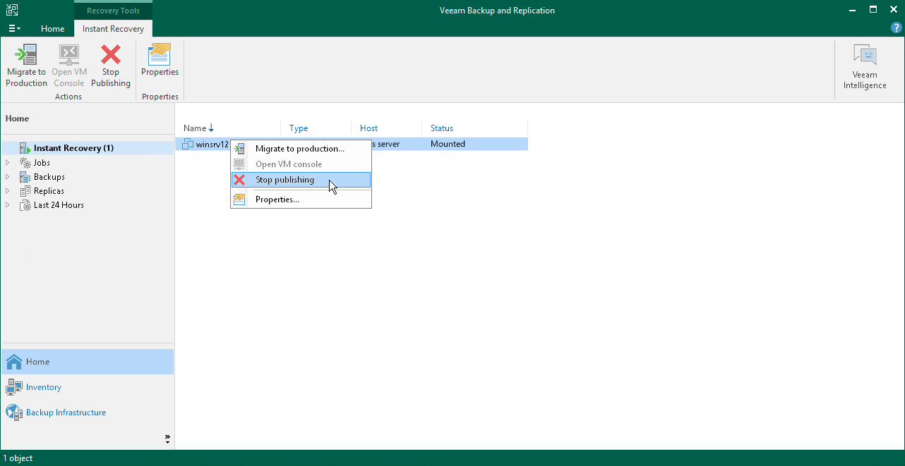

# Finalizing Instant FCD Recovery

In this article

After FCDs have been successfully registered, you must finalize the process and decide whether to migrate the disks to the production environment or stop publishing them.

Migrating FCDs

To migrate FCDs to the production environment:

1. Check [requirements for FCD migration](qm_byb_fcd.md).
2. Open the Home view.
3. In the inventory pane, select the Instant Recovery node.
4. In the working area, right-click the VM whose disks you recovered and select Migrate to production. Veeam Backup & Replication will launch the [FCD Quick Migration](migration_job_fcd.md) wizard.

After you finish working with the wizard, Veeam Backup & Replication migrates the disks with all changes made after the disk recovery and before its migration.

Stop Publishing FCDs

You can stop publishing FCDs. This will remove the registered FCDs from the cluster that you selected as the destination for recovery. Note that all changes made to the FCDs will be lost.

To stop publishing FCDs:

1. Open the Home view.
2. In the inventory pane, select the Instant Recovery node.
3. In the working area, right-click a VM whose disks you recovered and select Stop publishing.

Page updated 2/13/2024

Page content applies to build 13.0.1.1071
