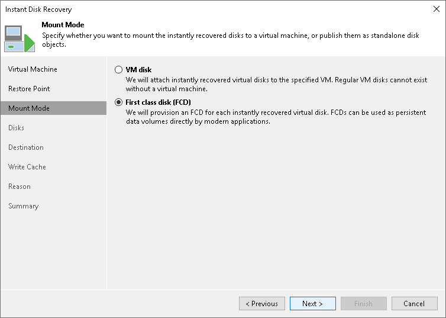

# Step 4. Select Mount Mode

At the Mount Mode step of the wizard, select the First class disk (FCD) option to register virtual disks on a cluster as FCDs.

Select the Mount to all hosts in a cluster check box to mount the vPower NFS datastore to all ESXi hosts in the cluster. Veeam Backup & Replication uses a temporary vPower NFS datastore to run the VMs directly from backups. Use Mount to all hosts in a cluster to provide datastore redundancy and to avoid the vCenter Server alarm reporting that the datastore is connected to a single host.

To register virtual disks on a VM added to an ESXi host, select the VM disk option. In this case, steps of the wizard differ and Veeam Backup & Replication performs the instant disks recovery as described in section [Performing Instant Disk Recovery](performing_instant_disk_recovery.md).

Page updated 2026-07-15

