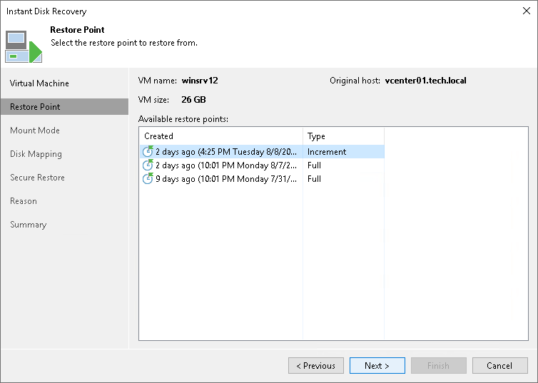

# Step 3. Select Restore Point

In this article

At the Restore Point step of the wizard, select a restore point for the VM whose virtual disks you want to register as FCDs.

Page updated 1/25/2024

Page content applies to build 13.0.1.1071
