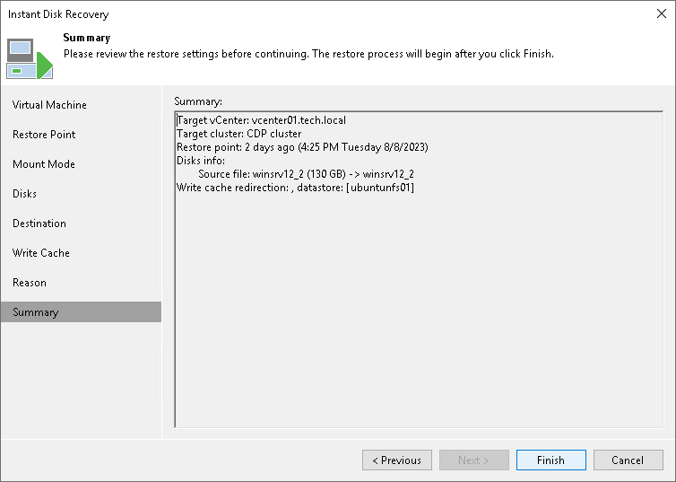

# Step 9. Verify Instant FCD Recovery Settings

At the Summary step of the wizard, check settings of Instant FCD Recovery and click Finish.

What You Do Next

[Finalizing Instant FCD Recovery](instant_fcd_recovery_finalize.md)

