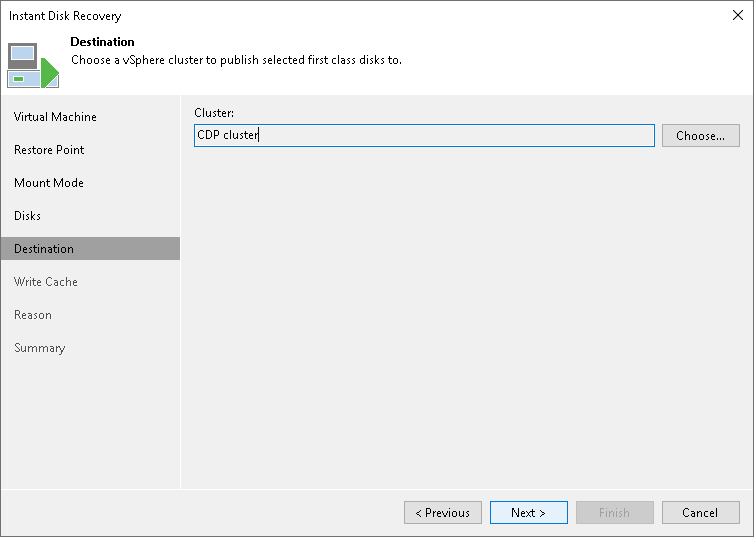

# Step 6. Specify Target Cluster

In this article

At the Destination step of the wizard, specify a cluster where Veeam Backup & Replication will register FCDs.

|  |
| --- |
| Important |
| To register FCDs on a cluster, Veeam Backup & Replication mounts to a cluster the vPower NFS datastore that contains virtual disks. Veeam Backup & Replication checks the cluster hosts to verify that they are powered on and Veeam Backup & Replication is able to connect to these hosts. If one of these hosts is not available, Veeam Backup & Replication will not include them to the FCD restore scenario. Veeam Backup & Replication will not start the Instant FCD Recovery process if there are no powered on hosts or Veeam Backup & Replication is not able to connect to them. |

Page updated 1/25/2024

Page content applies to build 13.0.1.1071
