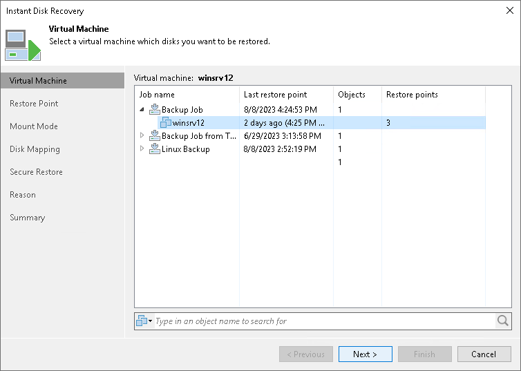

# Step 2. Select Source VM

In this article

At the Virtual Machine step of the wizard, select a VM whose disks you want to register as FCDs.

Page updated 1/25/2024

Page content applies to build 13.0.1.1071
