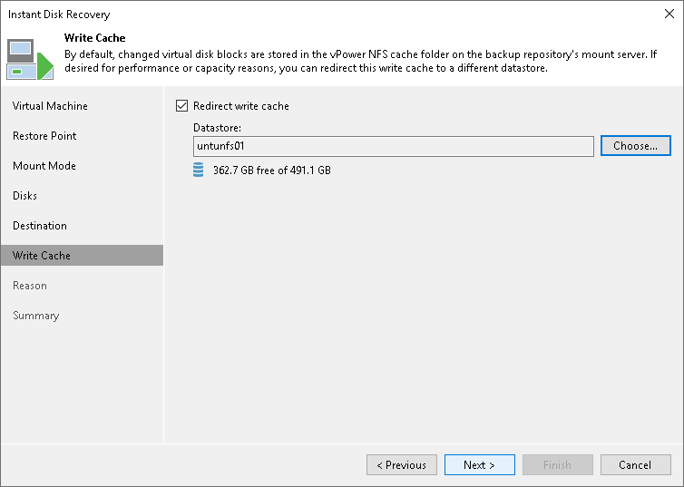

# Step 7. Select Destination for FCD Updates

In this article

At the Write Cache step of the wizard, specify where to store the redo logs. Veeam Backup & Replication uses redo logs to write all changes of the virtual disks that take place while performing Instant FCD Recovery.

By default, redo logs are stored on the [vPower NFS server](vpower_nfs_service.md). You can store redo logs on any datastore in the virtual environment. As soon as a recovery verification job completes, Veeam Backup & Replication deletes redo logs.

To redirect redo logs:

1. Select the Redirect write cache check box.
2. Click Choose and select a datastore from the list.

Page updated 1/25/2024

Page content applies to build 13.0.1.1071
