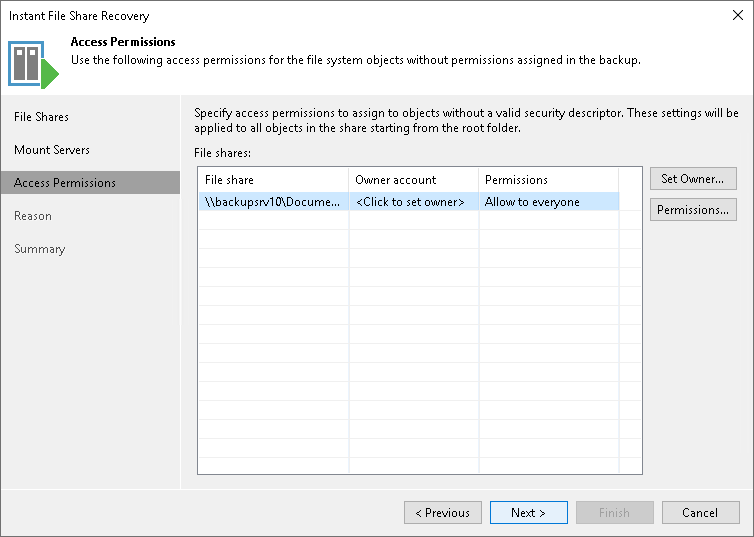

# Step 4. Specify Access Permissions

After you specify file shares and mount servers, Veeam Backup & Replication validates them. If Veeam Backup & Replication detects missing security descriptors on the file shares, it adds the Access Permissions step to the wizard. At this step you can specify the owner account and permissions for the file share.

1. From the File shares list, select a file share for which you want to specify an owner account and permissions.
2. Click Set Owner and specify the owner account for the file share.
3. Click Permissions and configure access permissions for the file share. The following options are available:

* Deny to everyone
* Allow to everyone
* Allow to the following accounts or groups only

Use Add and Remove buttons to configure accounts and groups to which you want to grant permissions for accessing the file share.

Adding Linux Mount Host to Domain

If you use a Linux mount server and want to specify an Active Directory account as the owner, you must join the Linux mount server to the domain using Samba:

1. On the Linux mount server, open the Shell.
2. Install the realmd system:

|  |
| --- |
| $ sudo dnf install -y realmd |

1. Make sure that the domain controller is accessible from the Linux machine:

|  |
| --- |
| $ realm discover <ad-domain-name> |

1. Use the realmd system to join the domain:

|  |
| --- |
| $ sudo realm join -v --membership-software=samba --client-software=winbind --user=<domain-user> <ad-domain-name> |

1. Make sure that Samba is connected to the domain controller.

|  |
| --- |
| $ sudo wbinfo --ping-dc |

