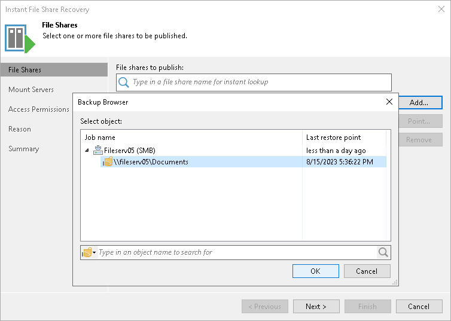

# Step 2. Select File Share to Restore

At the File Shares step of the wizard, select the file share you want to instantly recover:

1. Click Add.
2. In the Backups Browser window, expand the necessary backup job to select the required file share to restore.

To quickly find a file share, you can use the search field at the bottom of the window.

1. Enter a file share name or a part of it in the search field.
2. Press [Enter] to start the search.

Alternatively, you can use the File shares to publish search field to quickly search the required file share and add it to the list of file shares to publish.

