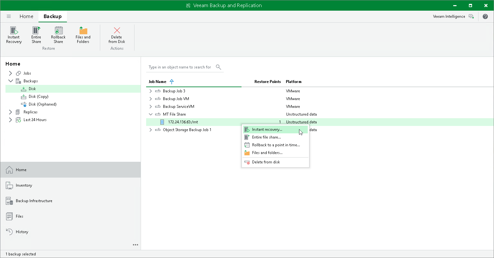

# Step 1. Launch Instant File Share Recovery Wizard

To launch the Instant File Share Recovery wizard, do one of the following:

* In the Home tab on the ribbon, click Restore > File Share. In the Restore from File Backup window, click Instant recovery.
* Open the Home view. In the inventory pane, select Backups. In the working area, expand the necessary backup and do one of the following:

* Click the file share that you want to restore. In the Backup tab on the ribbon, click Instant Recovery.
* Right-click the file share that you want to restore and select Instant recovery.

You can perform the instant file share recovery by using a backup copy. Backup copies created in the secondary repositories are represented in the Backups > Disk (Copy) node in the inventory pane. If the secondary repository is an object storage repository, backup copies created in it are represented in the Backups > Object Storage (Copy) node in the inventory pane.

