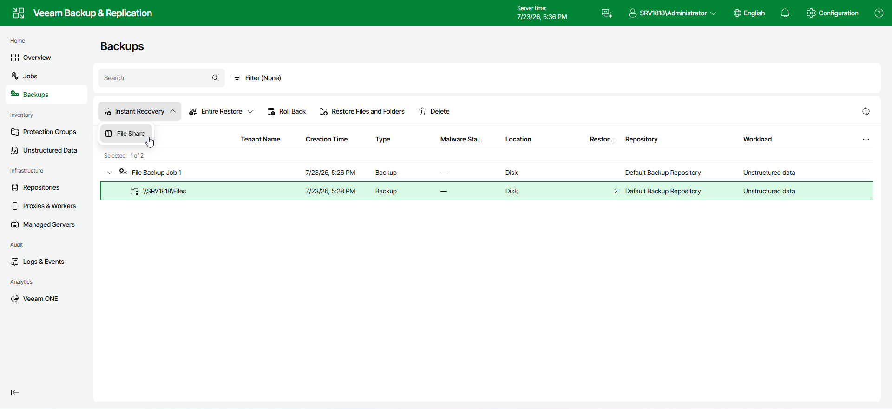

# Step 1. Launch Instant File Share Recovery Wizard

To launch the Instant File Share Recovery wizard, do the following:

1. In the management pane, click the Backups node.
2. In the working area, expand the necessary backup.
3. Click Instant Recovery on the ribbon.
4. From the drop-down list, select File Share.

Alternatively, right-click the file share that you want to restore and select Instant Recovery > File Share.

Page updated 2026-07-27

