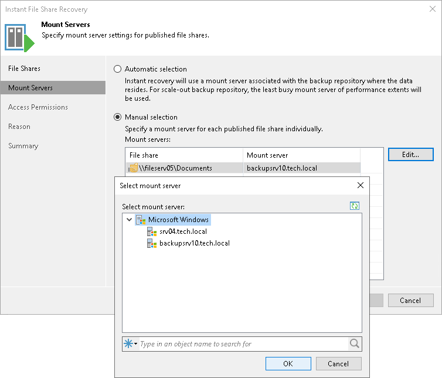

# Step 3. Specify Mount Server Settings

In this article

At the Mount Servers step of the wizard, specify mount server settings for published file shares.

* If you select the Automatic selection option, Veeam Backup & Replication will automatically choose the mount server where to restore file shares. The job will use the mount server from the repository where the backup files reside. For scale-out backup repositories, Veeam Backup & Replication will use the least occupied mount server.
* If you select the Manual selection option, you can specify which mount server to use to individually publish each file share:

1. In the Mount servers list, select a file share for which you want to assign a mount server.
2. Click Edit. Alternatively you can double-click the required file share in the list.
3. In the Select mount server window, select a mount server to use to publish the chosen file share.

To quickly find a mount server, you can use the search field at the bottom of the window.

1. Click OK to confirm selection.

|  |
| --- |
| Note |
| Consider that data on the mounted file share may be available to the users added to the Administrators group on this mount server. |

Page updated 6/3/2024

Page content applies to build 13.0.1.1071
