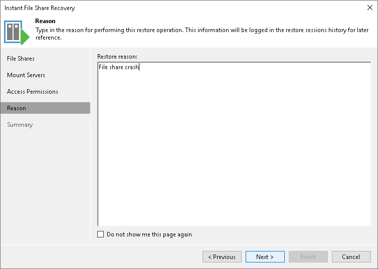

# Step 5. Specify Reason for Recovery

At the Reason step of the wizard, specify the reason for performing instant file share recovery. You can leave the field blank.

|  |
| --- |
| Tip |
| If you do not want to show this page, select the Do not show me this page again check box. If you want to unhide this page, follow the instructions described in [this Veeam KB article](https://www.veeam.com/kb4432). |

