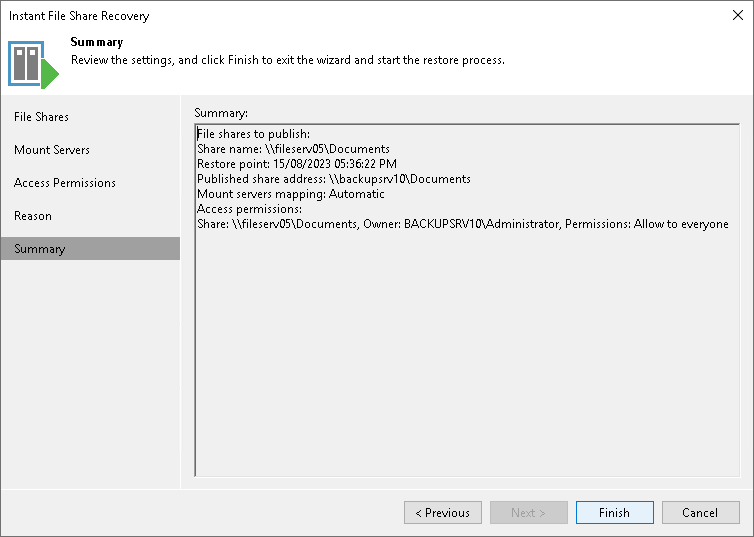

# Step 6. Finish Working with Wizard

At the Summary step of the wizard, review the instant file share recovery settings and click Finish. Veeam Backup & Replication will publish the file share to the specified mount servers.

