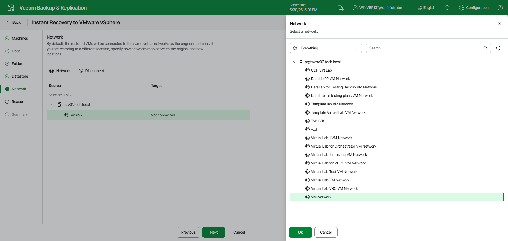

# Step 7. Configure Network

This step is available if you recover workloads other than VMware vSphere VMs and VMware Cloud Director VMs.

At the Network step of the wizard, configure a network mapping table. This table maps networks in the original site to networks in the target site (site where workloads will be recovered). When the job starts, Veeam Backup & Replication will check the network mapping table. Then Veeam Backup & Replication will update workload configuration files to replace the original networks with the specified networks in the target site. As a result, you will not have to re-configure network settings manually.

To change networks to which the recovered workloads will be connected:

1. In the list, select one or multiple workloads and click the Network button.

If a workload is connected to multiple networks, you can select a network to map and click Network.

1. The Select Network window displays all networks to which the target host or cluster is connected. In the list, select a network to which the recovered workload will be connected after recovery.

If you do not want to connect a recovered workload to any virtual network, select the original workload and click Disconnected.

Page updated 2026-06-30

