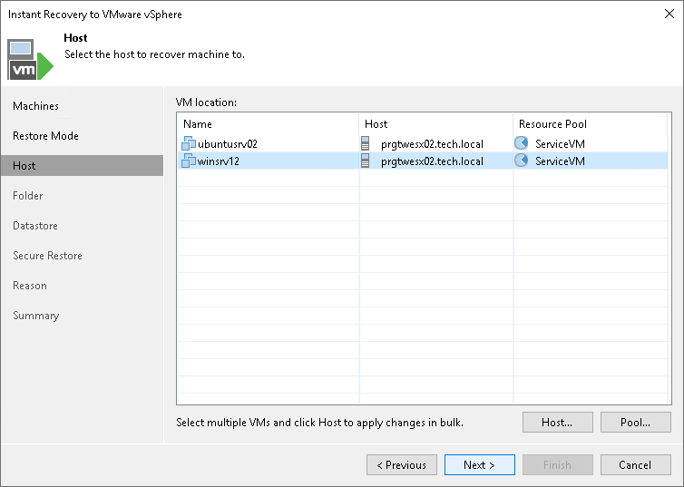
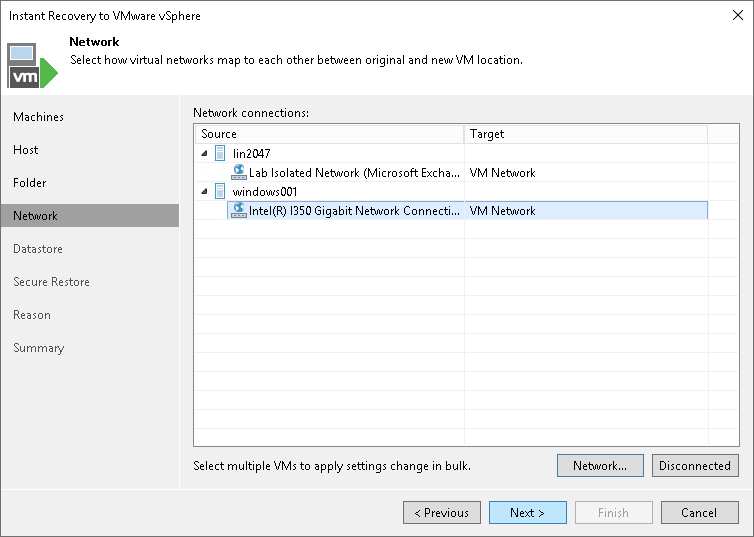

# Specifying Destination for Multiple VMs

In this article

The following steps are available if you recover multiple workloads and recover them to a new location or with different settings.

If you recover multiple workloads, specify the following settings for the destination:

1. [At the Host step of the wizard, select a target host](#host).
2. [At the Folder step of the wizard, specify VM settings](#vm).
3. [[For workloads other than VMware vSphere VMs and VMware Cloud Director VMs] At the Network step of the wizard, specify network settings](#network).

Selecting Target Host

At the Host step of the wizard, specify a target host and resource pool for recovered VMs:

1. In the list, select the necessary VMs and click the Host button.
2. From the virtual environment, select a standalone or clustered host where the selected VMs will be registered.

[For VMware vSphere VM recovery from storage snapshots] Veeam Backup & Replication will create a clone/virtual copy of the storage snapshot, mount it to the selected ESXi host and start the VM on this ESXi host.

1. Select one or multiple VMs and click the Pool button.
2. In the list, select a resource pool where the selected VMs will be stored.

Specifying VM Settings

For each recovered VM, you can change a VM name, BIOS UUID and folder where VM files must be stored. By default, the BIOS UUID is preserved.

We recommend that you specify a new name and generate a new BIOS UUID to prevent conflicts if the original workload still resides in the production environment. The name and BIOS UUID change is not required if the original workload no longer exists, for example, it was permanently deleted.

To specify a folder:

1. In the VM settings list, select the necessary VM. If you want to specify a folder for multiple VMs, select VMs that will be recovered to the same host.
2. Click the Folder button.
3. Select a folder where VM files must be stored.

To change a recovered VM name and BIOS UUID:

1. In the VM settings list, select one VM.
2. Click the Customize button.
3. In the VM Settings window, do the following:

1. In the Set name to field, specify a new VM name.
2. To add a prefix and suffix to the name specified in the Set name to field, select Add prefix and Add suffix check boxes.
3. In the BIOS UUID section, specify whether to preserve or generate a new BIOS UUID.

Specifying Network Settings

This step is available if you recover workloads other than VMware vSphere VMs and VMware Cloud Director VMs.

At the Network step of the wizard, configure a network mapping table. This table maps networks in the original site to networks in the target site (site where VMs will be recovered). When the job starts, Veeam Backup & Replication will check the network mapping table. Then Veeam Backup & Replication will update VM configuration files to replace the original networks with the specified networks in the target site. As a result, you will not have to re-configure network settings manually.

To change networks to which the recovered VMs will be connected:

1. In the list, select one or multiple workloads and click the Network button.

If a workload is connected to multiple networks, you can select a network to map and click Network.

1. The Select Network window displays all networks to which the target host or cluster is connected. In the list, select a network to which the recovered VM will be connected after recover.

If you do not want to connect a recovered VM to any virtual network, select the original workload and click Disconnected.

Page updated 3/12/2025

Page content applies to build 13.0.1.1071
