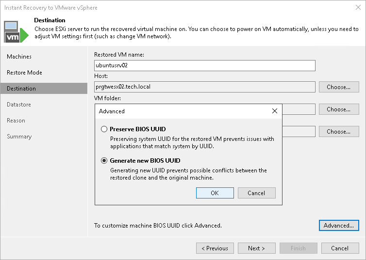

# Specifying Destination for One VM

In this article

The Destination step of the wizard is available if you recover one workload and recover it to a new location or with different settings.

At this step of the wizard, you configure destination settings such as the recovered VM name, target host, VM folder and so on. For workloads other than VMware vSphere VMs and VMware Cloud Director VMs, you must also configure a network mapping table. This table maps networks in the original site to networks in the target site. When the job starts, Veeam Backup & Replication will check the network mapping table. Then Veeam Backup & Replication will update VM configuration files to replace the original networks with the specified networks in the target site. As a result, you will not have to re-configure network settings manually.

To specify the destination and network mapping settings for a recovered VM:

1. In the Restored VM name field, specify a name under which the workload will be recovered.
2. In the Host field, specify a host on which the VM will run.

[For VMware vSphere VM recovery from storage snapshots] Veeam Backup & Replication will create a clone/virtual copy of the storage snapshot, mount it to the selected ESXi host and start the VM on this ESXi host.

1. In the VM folder field, specify a folder to which the recovered VM files will be placed.
2. In the Resource pool list, select a resource pool to which the VM will be placed.
3. [For workloads other than VMware vSphere VMs and VMware Cloud Director VMs] In the Networks section, configure the network mapping table. To configure one row of the table, select a network in the list and click Choose. The Select Network window displays all networks to which the target host or cluster is connected. In the list of networks, select a network to which the recovered VM will be connected instead of the original network.
4. Click the Advanced button and choose whether to preserve the BIOS UUID or generate a new BIOS UUID. By default, the BIOS UUID is preserved.

We recommend that you select to generate a new BIOS UUID for the recovered VM to prevent conflicts if the original workload still resides in the production environment. The BIOS UUID change is not required if the original VM no longer exists, for example, it was deleted.

Page updated 3/12/2025

Page content applies to build 13.0.1.1071
