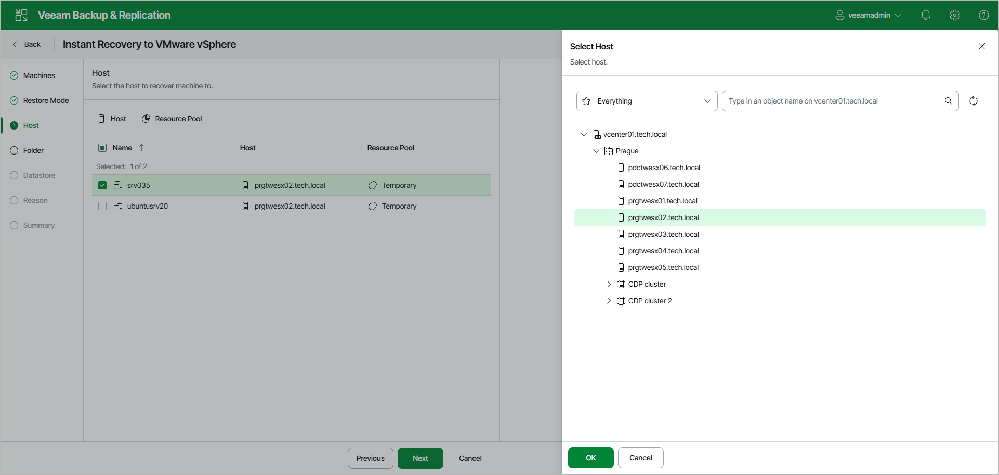

# Step 4. Select Target Hosts and Resource Pools

The Host step of the wizard is available if you have selected Restore to a new location or with different settings at the [Restore Mode](instant_recovery_mode_vm_web.md) step.

In the list, select the necessary workloads. Click Host to specify the host where the workloads will be recovered or click Resource Pool to specify a resource pool. To save the changes, click OK.

At the Host step of the wizard, specify a target host and resource pool for recovered VMs:

1. Select the Mount to all hosts in a cluster check box to mount the vPower NFS datastore to all ESXi hosts in the cluster. Veeam Backup & Replication uses a temporary vPower NFS datastore to run the VMs directly from backups.

Use Mount to all hosts in a cluster to provide datastore redundancy and to avoid the vCenter Server alarm reporting that the datastore is connected to a single host.

1. In the list, select the necessary workloads and click the Host or Cluster button.
2. From the virtual environment, select a standalone host, clustered host or cluster where the selected workload will be registered.

[For VMware vSphere VM recovery from storage snapshots] Veeam Backup & Replication will create a clone/virtual copy of the storage snapshot, mount it to the selected ESXi host and start the VM on this ESXi host.

1. Select one or multiple workloads and click the Resource Pool button.
2. In the list, select a resource pool where the selected workloads will be stored.

Page updated 2026-06-30

