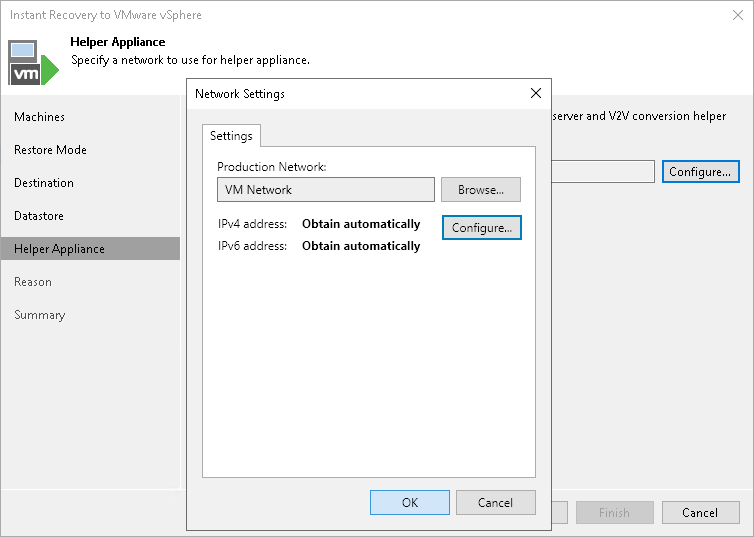

# Step 7. Configure Helper Appliance

In this article

This step is available if you recover workloads with Linux OS, recover them to a new location or with different settings, and VIX API is not available. However, this step is not available if you recover VMware vSphere VMs from storage snapshots.

Veeam Backup & Replication recovers Linux machines to a standalone host using a helper appliance. The helper appliance is an auxiliary Linux-based VM registered by Veeam Backup & Replication. The appliance is quite small — around 150 MB. It requires the same amount of RAM as the VM being restored and takes around 10 seconds to boot.

To configure the helper appliance:

1. [For multiple machines] In the Network list, expand a host and select one machine.
2. Click the Configure button.
3. In the Network Settings window, select a network for the helper appliance.

1. Click the Browse button near the Production network field.
2. In the Select Network window, Veeam Backup & Replication shows a list of networks to which the target host is connected. In this list, select a network to which the helper appliance must be connected.

Consider that the backup server and the mount server must have access to the helper appliance over the network.

1. Specify IP addressing settings for the helper appliance and DNS server:

1. Click Configure.
2. Switch to the IPv4 or IPv6 tab depending on which addresses you want to configure. Note that you can use IPv6 addresses only if IPv6 communication is enabled as described in section [IPv6 Support](ipv6.md).
3. Select the Enable IPv4/IPv6 interface check box.
4. Configure IP settings for the helper appliance:

* If you use a DHCP server in the network and want to obtain the IP address automatically, leave the Obtain an IP address automatically option selected.

* To manually assign a specific IP address to the helper appliance, click Use the following IP address and specify the IP address settings.

1. Configure IP settings for the DNS server:

* If you use a DHCP server in the network and want to obtain the IP address automatically, leave the Obtain DNS server address automatically option selected.

* To manually assign a specific IP address to the DNS server, click Use the following DNS server address and specify preferred and alternate addresses.

1. Click OK.

Page updated 3/11/2025

Page content applies to build 13.0.1.1071
