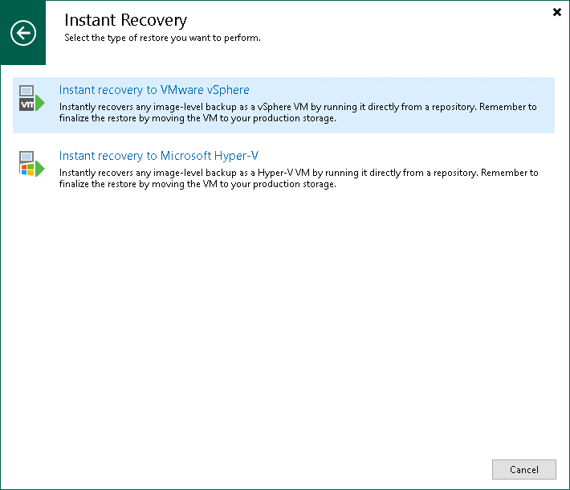

# Step 1. Launch Instant Recovery Wizard

To launch the Instant Recovery to VMware wizard, do one of the following:

* On the Home tab, click Restore and select one of the following:

* VMware vSphere > Restore from backup > Entire VM restore > Instant recovery > Instant recovery to VMware vSphere — if you want to recover VMware vSphere VMs from a VM backup created by Veeam Backup & Replication or you want to recover VMware vSphere VMs from storage snapshots.
* VMware Cloud Director > Restore from backup > VM restore > Entire VM restore > Instant recovery > Instant recovery to VMware vSphere — if you want to recover VMware Cloud Director VMs from a VM backup created by Veeam Backup & Replication.
* Microsoft Hyper-V > Restore from backup > Entire VM restore > Instant recovery > Instant recovery to VMware vSphere — if you want to recover Hyper-V VMs from a VM backup created by Veeam Backup & Replication.
* Agent > Entire machine restore > Instant recovery > Instant recovery to VMware vSphere — if you want to recover physical machines from a backup created by Veeam Agent for Microsoft Windows or Veeam Agent for Linux.
* AWS > Entire machine restore > Instant recovery > Instant recovery to VMware vSphere — if you want to recover EC2 instances from a backup created by Veeam Backup for AWS.
* Azure IaaS backup > Entire machine restore > Instant recovery > Instant recovery to VMware vSphere — if you want to recover Azure VMs from a backup created by Veeam Backup for Microsoft Azure.
* GCE backup > Entire machine restore > Instant recovery > Instant recovery to VMware vSphere — if you want to recover VM instances from a backup created by Veeam Backup for Google Cloud.

* Nutanix backup > Entire machine restore > Instant recovery > Instant recovery to VMware vSphere — if you want to recover VMs from backups created by Veeam Plug-In for Nutanix AHV.
* oVirt KVM > Entire machine restore > Instant recovery > Instant recovery to VMware vSphere — if you want to recover VMs from backups created by Veeam Backup for OLVM and RHV.
* Proxmox VE > Entire machine restore > Instant recovery > Instant recovery to VMware vSphere — if you want to recover VMs from backups created by Veeam Plug-In for Proxmox VE.
* Scale Computing HyperCore > Entire machine restore > Instant recovery > Instant recovery to VMware vSphere — if you want to recover VMs from backups created by Veeam Plug-In for Scale Computing HyperCore.

* Open the Home view. In the inventory pane, select Backups. In the working area, expand the necessary backup, select workloads that you want to recover and click Instant Recovery > VMware vSphere on the ribbon. Alternatively, you can right-click one of the selected workloads and select Instant recovery > VMware vSphere.

[For vSphere] Alternatively, to recover VMware vSphere VMs from storage snapshots, you can open the Storage Infrastructure view. In the inventory pane, expand the storage system tree and select the necessary volume snapshot. In the working area, select the necessary VMs and click Instant Recovery on the ribbon.

