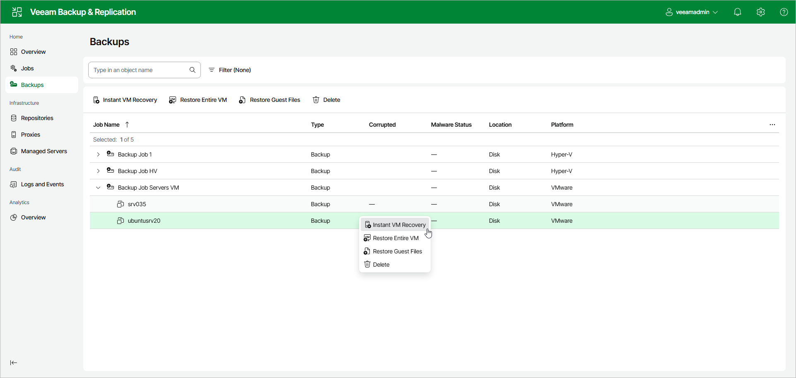

# Step 1. Launch Instant Recovery Wizard

To launch Instant Recovery using the web UI, do the following:

1. Select Backups in the management pane.
2. In the working area, select workloads whose files you want to recover.
3. Click Instant VM Recovery > VMware vShpere. Alternatively, right-click one of the selected workloads and click Instant VM Recovery > VMware vShpere.

Page updated 2026-07-13

