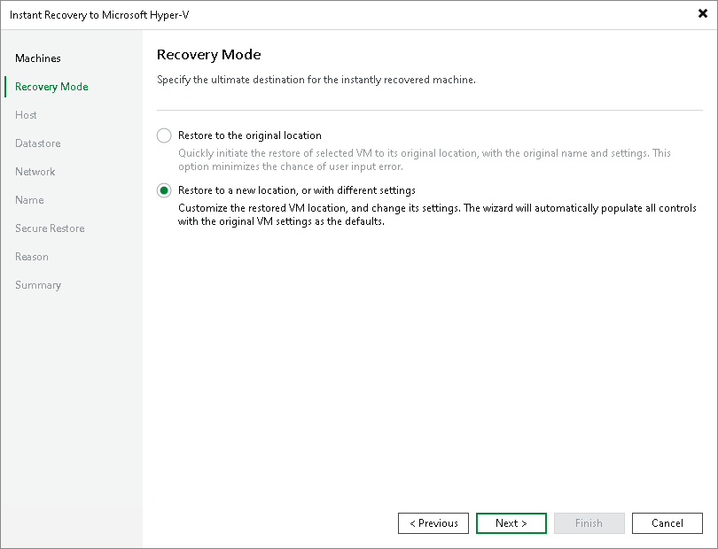

# Step 4. Select Recovery Mode

In this article

This step is available only if you recover Hyper-V VMs.

At the Recovery Mode step of the wizard, choose the necessary restore mode:

* Select Restore to the original location if you want to recover workloads with initial settings and to original location. If this option is selected, you will pass directly to the [Reason step](ir_reason_hv.md) of the wizard.
* Select Restore to a new location, or with different settings if you want to recover VMs to a different location and with different settings (such as location, network settings and so on). If this option is selected, the Instant Recovery to Hyper-V wizard will include additional steps for customizing VM settings.

|  |
| --- |
| Important |
| If you recover a VM to the original location, consider the following:   * If the original VM still exists in the virtual infrastructure, the VM and its disks will be removed. Make sure that other VMs in the virtual environment do not use these disks. * The VM settings contain the ID of the VM group to which the machine belongs. To recover the VM to the original VM group, you must not delete the original VM group or change the hierarchy of its parent VM groups. |

Page updated 8/13/2025

Page content applies to build 13.0.1.1071
