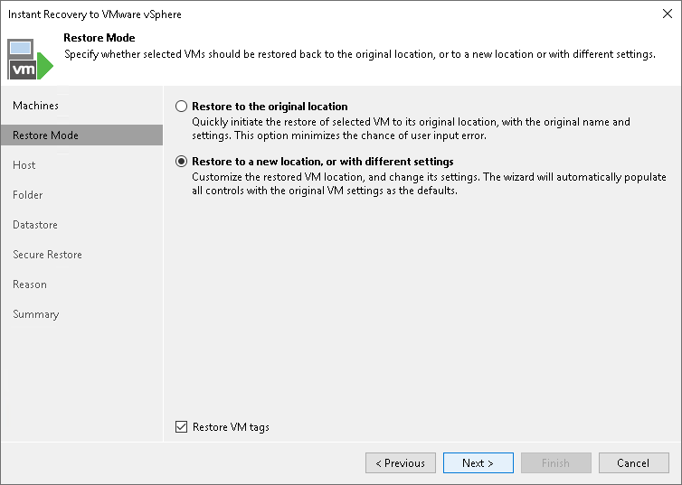

# Step 4. Select Restore Mode

In this article

This step is available only if you recover VMware vSphere VMs or VMware Cloud Director VMs.

At the Restore Mode step of the wizard, specify a destination for VM recovery and whether you want to recover VM tags:

1. Select a destination for recover:

* Restore to the original location — select this option if you want to recover VMs with their initial settings and to their original location. If this option is selected, you will pass directly to the [Reason](instant_recovery_reason_vm.md) step of the wizard.

|  |
| --- |
| Important |
| If you recover a VM with the original settings, and the original VM still exists in the virtual infrastructure, the original VM will be removed. |

* Restore to a new location, or with different settings — select this option if you want to recover VMs to a new location, or to any location but with different settings (such as VM location, network settings, format of recovered virtual disks and so on). If this option is selected, the Instant Recovery to VMware wizard will include additional steps for customizing VM settings.

1. If you want to recover tags that were assigned to the original VMs and assign them to the recovered VMs, select the Restore VM tags check box. Veeam Backup & Replication will recover the VMs with original tags if the following conditions are met:

1. You recover VMs to their original location.
2. The original VM tags are available on the source vCenter Server.

Page updated 3/11/2025

Page content applies to build 13.0.1.1071
