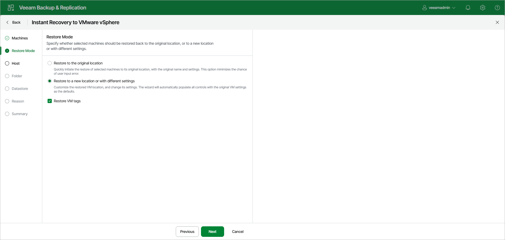

# Step 3. Select Restore Mode

At the Restore Mode step of the wizard, specify a destination for recovery and whether you want to recover VM tags:

1. Select a destination for recovery:

* Restore to the original location — select this option if you want to recover workloads with their initial settings to the original location. If you select this option, you will pass directly to the [Reason](instant_recovery_reason_vm_web.md) step of the wizard.

|  |
| --- |
| Important |
| If you recover a workload with the original settings, and the original workload still exists in the virtual infrastructure, the original workload will be removed. |

* Restore to a new location or with different settings — select this option if you want to recover workloads to a new location, or to any location but with different settings (such as location, network settings, format of recovered virtual disks and so on). If this option is selected, the Instant Recovery to VMware wizard will include additional steps for customizing settings.

1. If you want to recover tags that were assigned to the original workloads and assign them to the recovered workloads, select the Restore VM tags check box. Veeam Backup & Replication will recover the workloads with original tags if the following conditions are met:

1. You recover workloads to their original location.
2. The original tags are available on the source vCenter Server.

