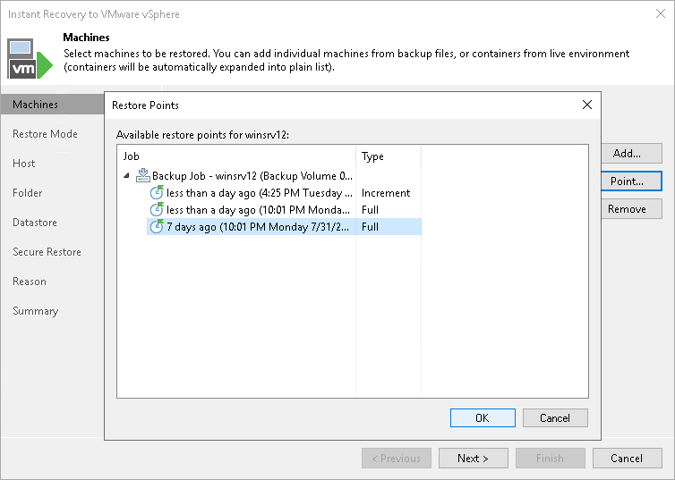

# Step 3. Select Restore Point

By default, Veeam Backup & Replication uses the latest valid restore point to recover workloads. You can recover a workload to an earlier state, if necessary:

1. In the Machines to restore list, select a workload.
2. Click Point on the right.
3. In the Restore Points window, select a restore point from which you want to recover the workload.

