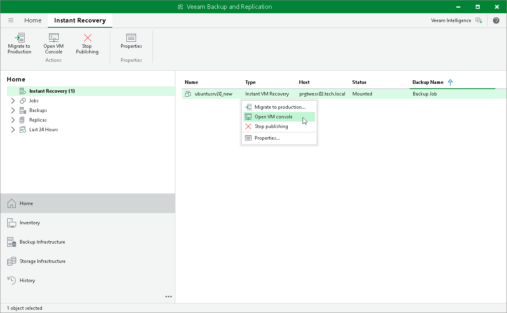
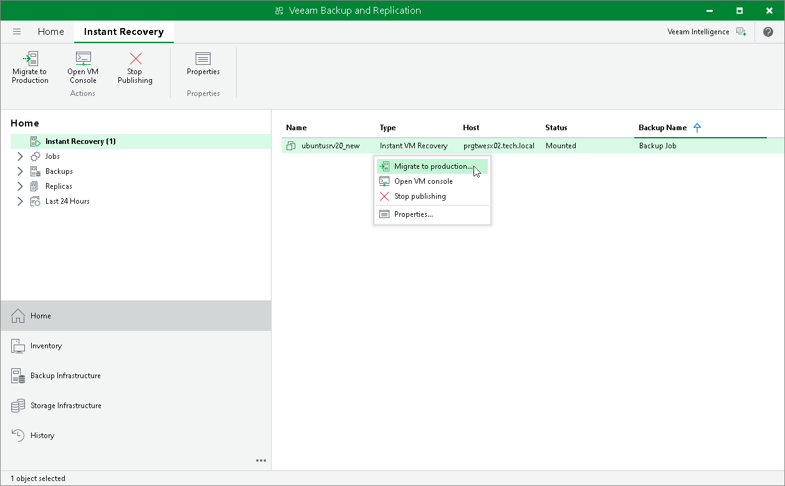

# Step 11. Finalizing Instant Recovery to VMware vSphere

In this article

After the VMs have been successfully recovered, you must finalize the process. For this, test the recovered VMs and decide whether to migrate them to production environment or stop publishing.

* [Testing recovered VMs](#test)
* [Migrating recovered VMs](#migrate)
* [Stop publishing recovered VMs](#remove)

Testing Recovered VMs

To test the recovered VMs before you migrate them to production, you can launch the VMware Remote Console (VMRC) from the Veeam Backup & Replication console.

|  |
| --- |
| Important |
| VMware Remote Console is not included as part of Veeam Backup & Replication installation and must be installed separately. For details, see [Install the VMware Remote Console Application](https://techdocs.broadcom.com/us/en/vmware-cis/vsphere/vsphere/8-0/install-the-vmware-remote-console.html). |

To open a VM console in Veeam Backup & Replication:

1. Open the Home view.
2. In the inventory pane, select the Instant Recovery node.
3. In the working area, right-click a VM and select Open VM console.

Migrating Recovered VMs

If the VMs were recovered successfully, you can migrate them to the production environment.

To migrate a recovered VM to the production environment:

1. Open the Home view.

1. In the inventory pane, select the Instant Recovery node.

1. In the working area, right-click a VM and select Migrate to production. Veeam Backup & Replication will launch the Quick Migration wizard. For more information on requirements and limitations for Quick Migration, see [Migrating VMs](migration_job_hv.md).

During migration, Veeam Backup & Replication will recover the VM from the backup file and additionally move all changes that were made while the VM was running from the backup in the Instant Recovery mode.

If you have launched Instant Recovery to a different location and you want to protect the recovered VM after migration finishes, you need to add the recovered VM to a backup job manually. If you have launched Instant Recovery to the original location, your actions depend on the method used for migration and whether the Delete source VM files upon successful migration check box is enabled in the migration wizard. For more information, see [Finish Working with the Quick Migration Wizard](quick_migration_summary_hv.md).

Stop Publishing Recovered VMs

If your tests have failed, you can stop publishing the recovered VMs. This will remove the recovered VMs from the host that you selected as the destination for recovery. Note that all changes made in the recovered VMs will be lost.

|  |
| --- |
| Important |
| [For restore to original location] Both the recovered and original VMs are removed if you stop publishing the recovered VM. This is because during restore to the original location, Veeam Backup & Replication removes the original VM. |

To stop publishing a recovered VM:

1. Open the Home view.
2. In the inventory pane, select the Instant Recovery node.
3. In the working area, right-click a VM and select Stop publishing.

Page updated 8/20/2025

Page content applies to build 13.0.1.1071
