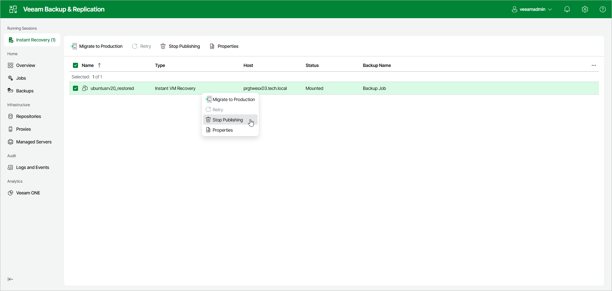

# Step 9. Finalizing Instant Recovery to VMware vSphere

After the VMs have been successfully recovered, you must finalize the process. For this, test the recovered VMs in the VMware Remote Console (VMRC) and decide whether to migrate them to production environment or stop publishing.

Migrating Recovered VMs

If the VMs were recovered successfully, you can migrate them to the production environment. During migration, Veeam Backup & Replication will recover the VM from the backup file and additionally move all changes that were made while the VM was running from the backup in the Instant Recovery mode.

To migrate a VM, click Instant Recovery in the management pane. Select the VM and click Migrate to Production. Alternatively, right-click the VM and select Migrate to Production. Veeam Backup & Replication will launch the Quick Migration wizard. For more information on requirements and limitations for Quick Migration, see [Migrating VMs Using Web UI](migration_job_web.md).

If you have launched Instant Recovery to a different location and you want to protect the recovered VM after migration finishes, you need to add the recovered VM to a backup job manually. If you have launched Instant Recovery to the original location, your actions depend on the method used for migration and whether the Delete source VM files upon successful migration check box is enabled in the migration wizard. For more information, see [Finish Working with the Quick Migration Wizard](quick_migration_summary_hv.md).

Stop Publishing Recovered VMs

If your tests have failed, you can stop publishing the recovered VMs. This will remove the recovered VMs from the host that you selected as the destination for recovery. Note that all changes made in the recovered VMs will be lost.

To stop publishing a VM, click Instant Recovery in the management pane. Select the VM and click Stop Publishing. Alternatively, right-click the VM and select Stop Publishing.

|  |
| --- |
| Important |
| [For restore to original location] Both the recovered and original VMs are removed if you stop publishing the recovered VM. This is because during restore to the original location, Veeam Backup & Replication removes the original workload. |

