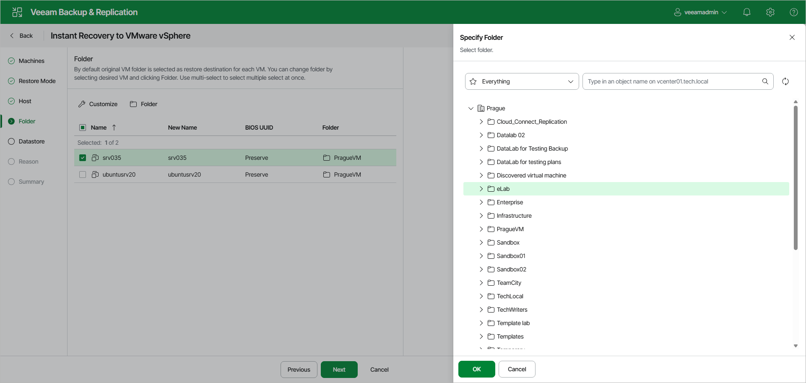

# Step 5. Configure VM Settings and Folders

The Folder step of the wizard is available if you have selected Restore to a new location or with different settings at the [Restore Mode](instant_recovery_mode_vm_web.md) step.

At the Folder step of the wizard, specify a destination folder, change names and decide whether you want to preserve UUIDs. By default, Veeam Backup & Replication preserves the original names.

Specifying Destination Folders

To specify a destination folder:

1. Select workloads in the list and click Folder.
2. Choose a folder to which the recovered VM will be placed.
3. Click OK.

Changing Names and UUIDs

To change names and UUIDs:

1. Select the necessary workloads in the list and click Customize.
2. In the Change VM Settings window, enter a new name explicitly or specify a change name rule by adding a prefix or suffix to the original names.
3. In the BIOS UUID section, choose if you want to generate new UUIDs or preserve the existing ones.

