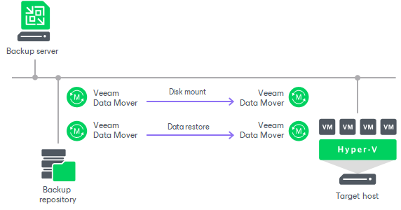

# Instant Recovery to Microsoft Hyper-V

With Instant Recovery to Microsoft Hyper-V, you can immediately recover different workloads (VMs, EC2 instances, physical servers and so on) as Microsoft Hyper-V VMs. Instant Recovery to Microsoft Hyper-V can be helpful, for example, if you want to migrate your infrastructure from one environment to another, or you want to recover your infrastructure in a matter of minutes but with limited performance.

During recovery, Veeam Backup & Replication runs workloads directly from compressed and deduplicated backup files. This helps improve recovery time objectives (RTO), minimize disruption and downtime of production workloads. The workloads are recovered in a matter of minutes.

When you perform Instant Recovery, Veeam Backup & Replication creates dummy VMs and mounts to VMs workload disks directly from backups stored on backup repositories. These dummy VMs have limited I/O performance. To provide full I/O performance, you must migrate the VMs to the production site. For more information, see [Migration of Recovered VMs to Production Site](#migrate).

Besides disaster recovery matters, Instant Recovery can also be used for testing purposes. Instead of extracting workloads to production storage to perform regular disaster recovery (DR) testing, you can run a workload directly from a backup file, boot it and make sure the guest OS and applications are functioning properly. For more information, see [Finalizing Instant Recovery to Microsoft Hyper-V](ir_finalize_hv.md).

Instant Recovery supports bulk processing so you can immediately recover multiple workloads at once. If you perform Instant Recovery for several workloads, Veeam Backup & Replication uses the resource scheduling mechanism to allocate and use optimal resources required for Instant Recovery. For details, see [Resource Scheduling](resource_scheduling.md).

Supported Backup Types

You can recover workloads from the following types of backups:

* Backups of Microsoft Hyper-V virtual machines created by Veeam Backup & Replication

* Backups of VMware vSphere virtual machines created by Veeam Backup & Replication

* Backups of virtual and physical machines created by [Veeam Agent for Microsoft Windows or Veeam Agent for Linux](agents_introduction.md)

* Backups of Nutanix AHV virtual machines created by [Veeam Plug-In for Nutanix AHV](https://helpcenter.veeam.com/docs/vbahv/userguide/overview.html?ver=9)

* Backups of Amazon EC2 instances created by [Veeam Backup for AWS](https://helpcenter.veeam.com/docs/vbaws/guide/overview.html?ver=10)
* Backups of Microsoft Azure virtual machines created by [Veeam Backup for Microsoft Azure](https://helpcenter.veeam.com/docs/vbazure/guide/overview.html?ver=8.1)

* Backups of Google Compute Engine VM instances created by [Veeam Backup for Google Cloud](https://helpcenter.veeam.com/docs/vbgc/guide/welcome.html?ver=7)\*

* Backups of oVirt VMs created by [Veeam Backup for OLVM and RHV](https://helpcenter.veeam.com/docs/vbrhv/userguide/overview.html?ver=7)\*

* Backups of Proxmox VE VMs created by [Veeam Plug-In for Proxmox VE](https://helpcenter.veeam.com/docs/vbproxmoxve/userguide/overview.html?ver=3)

* Backups of Scale Computing HyperCore VMs created by [Veeam Plug-In for Scale Computing HyperCore](https://helpcenter.veeam.com/docs/vpsch/userguide/overview.html?ver=2)

\* - Available on Microsoft Windows-based backup server.

How Instant Recovery Works

Instant Recovery is performed in the following way:

1. Veeam Backup & Replication reads the workload configuration from the backup file in the backup repository and creates a dummy VM with empty disks on the target host. Before creating the dummy VM, Veeam Backup & Replication analyzes the workload configuration and decides on the generation for this VM:

* If the workload is a Hyper-V VM, Veeam Backup & Replication creates the dummy VM of the same generation.
* If Veeam Backup & Replication detects an EFI system partition, it creates a generation 2 VM.
* If Veeam Backup & Replication detects BIOS boot partition, it creates a generation 1 VM.
* If Veeam Backup & Replication detects at least one GPT partition, it creates a generation 2 VM.
* In other cases, Veeam Backup & Replication creates a generation 1 VM.

In other aspects, the created VM has the same settings as the workload in the backup file. If you select to preallocate disk space for the recovered VMs, Veeam Backup & Replication preallocates disk space at the beginning of the Instant Recovery process.

1. Veeam Backup & Replication initiates creation of a protective snapshot for the dummy VM and the VM is started. If the Instant Recovery process fails for some reason, the protective snapshot guarantees that no data is lost.
2. On the backup repository and on the target host, Veeam Backup & Replication starts a pair of Veeam Data Movers that are used to mount the VM disks from the backup file to the dummy VM.
3. On the target host, Veeam Backup & Replication starts a proprietary Veeam driver. The driver redirects requests to the file system of the recovered VM (for example, when a user accesses some application) and reads necessary data from the backup file in the backup repository using the pair of Veeam Data Movers that maintain the disk mount.

Migration of Recovered VMs to Production Site

When you begin the migration process, Veeam Backup & Replication starts one more pair of Veeam Data Movers — one Veeam Data Mover on the backup repository and one on the target host. This pair of Veeam Data Movers copies data of the recovered VM from the backup repository to the target host in the background, and populates disks of the VM started on the target host.

The driver on the target host knows which data has already been recovered permanently and does not redirect requests to such data, reading it directly from the disks of the recovered VM. Thus, performance of the instantly recovered VM will increase as more of the data is copied. When the VM is recovered completely, all Veeam Data Movers are stopped.

Related Topics

[Instant Recovery to VMware vSphere](instant_recovery.md)

