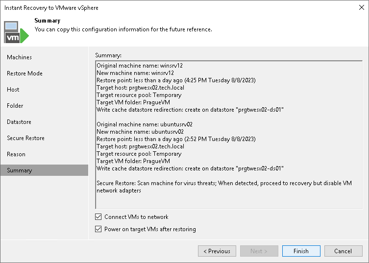

# Step 10. Verify Instant Recovery Settings

At the Summary step of the wizard, specify additional settings for Instant Recovery:

1. If you recover production workloads that have failed and want to recover them with initial network settings, select the Connect VMs to network check box.

If you recover workloads for testing disaster recovery while the original workloads are still running, leave this check box unselected. Before you power on the recovered VMs, you must disconnect them from the production network and connect to a non-production network to avoid conflicts.

1. To start the VMs right after recovery, select the Power on target VMs after restoring check box. If you recover the workloads to the production network, make sure that the original workloads are powered off.
2. Check settings that you have specified for Instant Recovery and click Finish.

1. Check that the publishing process has started and click Close.

What You Do Next

[Finalizing Instant Recovery to VMware vSphere](instant_recovery_review_vm.md)

