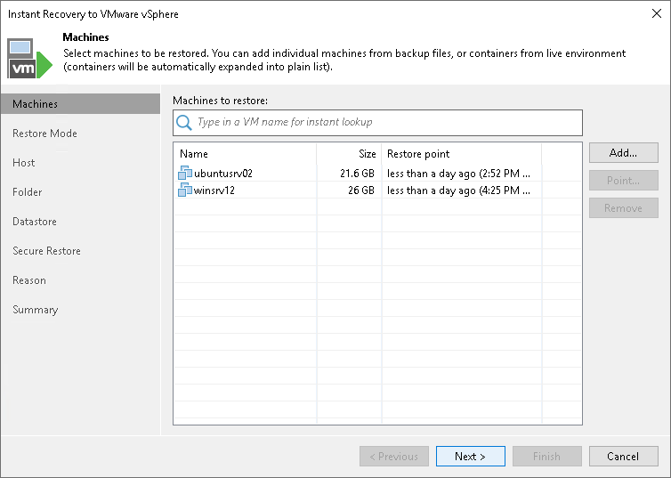

# Step 2. Select Workloads

At the Machines step of the wizard, select one or multiple workloads that you want to recover:

1. Click Add.
2. In the Backup Browser window, do the following:

1. [For VMware vSphere VMs and VMware Cloud Director VMs] Select where to browse for VMs:

* From infrastructure — browse the environment and select VMs or VM containers (hosts, clusters, folders, resource pools, VirtualApps, datastores or tags) to recover. If you select a VM container, Veeam Backup & Replication will expand it to a plain VM list.

When you add a VM to the list, Veeam Backup & Replication displays information about the most recent restore point in the Restore point column. If no restore point is available for the added VM, Veeam Backup & Replication displays a warning next to this VM.

* From backup — browse existing backups or storage snapshots and select virtual machines.

1. [For other workloads] In the list of backup jobs, expand a job and select workloads.
2. Click Add.

