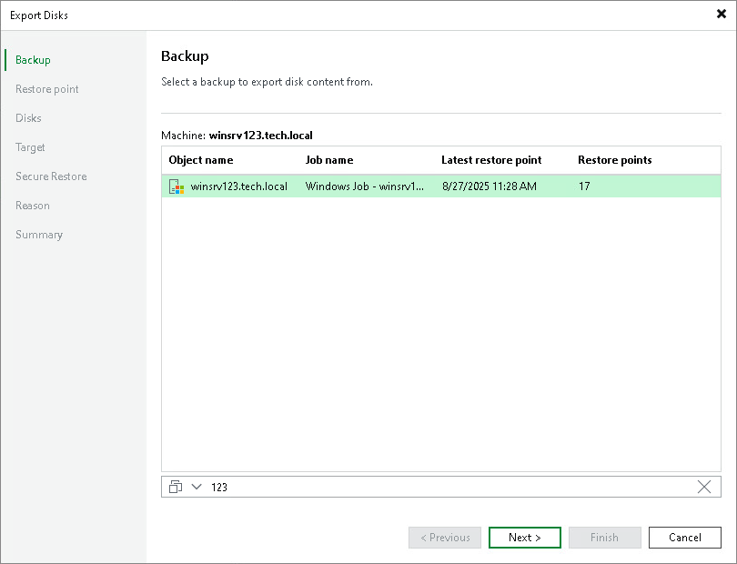

# Step 2. Select Backup

At the Backup step of the wizard, select a backup from which you want to restore disks. In the list of backups, Veeam Backup & Replication displays all backups that are currently hosted on the Veeam backup repository and Veeam Cloud Connect repository.

