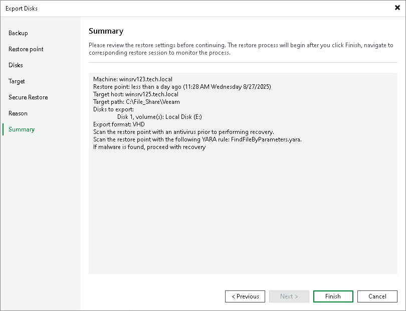

# Step 8. Complete Restore Process

In this article

At the Summary step of the wizard, complete the disk restore procedure.

1. Review details for the disk to be restored.
2. Click Finish to start the restore procedure and exit the wizard.

Page updated 11/19/2025

Page content applies to build 13.0.1.1071
