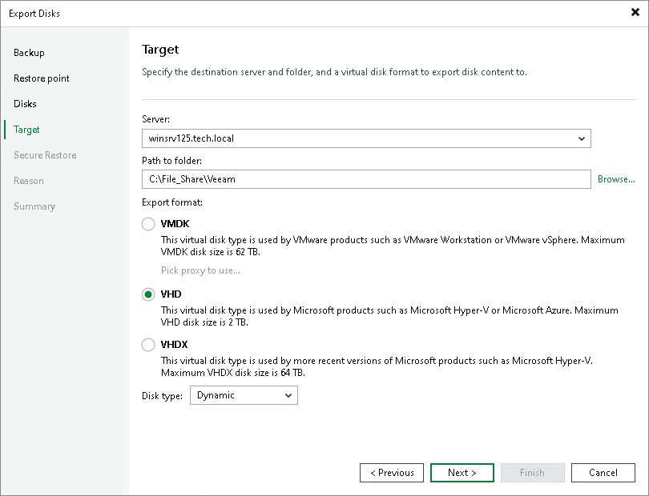

# Step 5. Select Destination and Disk Format

At the Target step of the wizard, select the destination for disk export and format in which you want to save the resulting virtual disk.

1. From the Server list, select a server on which the resulting virtual disks must be saved. If you plan to save the disks in the VMDK format on a datastore, select an ESXi host to which this datastore is connected.
2. In the Path to folder field, specify a folder on the server or datastore where the virtual disks must be placed.
3. Select the export format for disks:

* VMDK — select this option if you want to save the resulting virtual disk in the VMware VMDK format.

* VHD — select this option if you want to save resulting virtual disk in the Microsoft Hyper-V VHD format.
* VHDX — select this option if you want to save resulting virtual disk in the Microsoft Hyper-V VHDX format (supported by Microsoft Windows Server 2012 R2 and later).

1. Click Disk type to specify how the resulting disk must be saved:

* [For VMDK disk format] in the thin provisioned, lazy zeroed thick provisioned, or eagerly zeroed thick provisioned format
* [For VHD and VMDX disk formats] in the dynamic or fixed format

1. [For export of a VMDK disk to an ESXi host] Click the Pick proxy to use link to select backup proxies over which backup data must be transported to the target datastore.

|  |
| --- |
| NOTE |
| Consider the following:   * If you have selected to store the resulting virtual disk in a datastore, you will be able to save the virtual disk in the VMDK format only. Other options will be disabled. * If you have selected to store the resulting virtual disk on the server running Microsoft Windows Server OS and in the VMDK format, you will be able to save the virtual disk in the lazy zeroed thick provisioned format only. |

