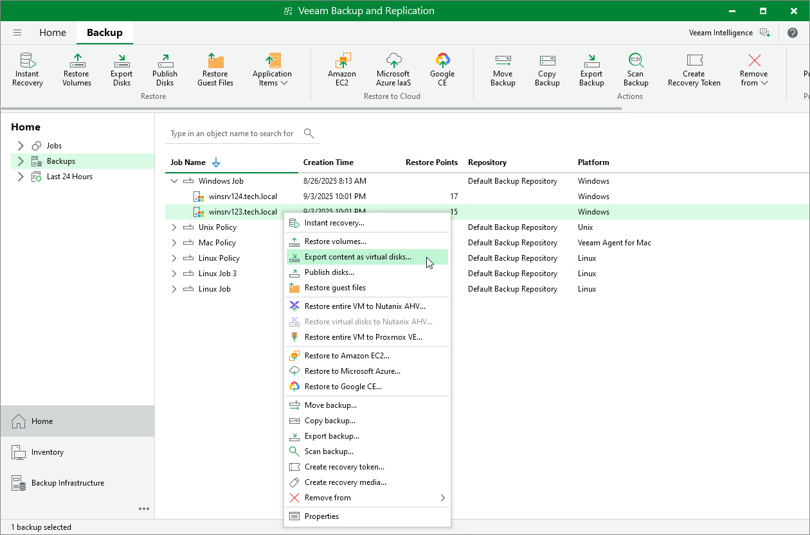

# Step 1. Launch Export Disk Wizard

To launch the Export Disk wizard, do either of the following:

* Open the Home tab and click Restore > Agent > Disk restore > Export disk. In this case, you will be able to select a backup of the necessary Veeam Agent computer at the [Backup](integration_disk_restore_backup.md) step of the wizard.
* Open the Home view. In the inventory pane, click the Backups node. In the working area, expand the necessary Veeam Agent backup, select the necessary computer in the backup and click Export Disks on the ribbon or right-click a computer in the backup and select Export content as virtual disks.

In this case, you will pass immediately to the [Restore Point](integration_disk_restore_point.md) step of the wizard.

