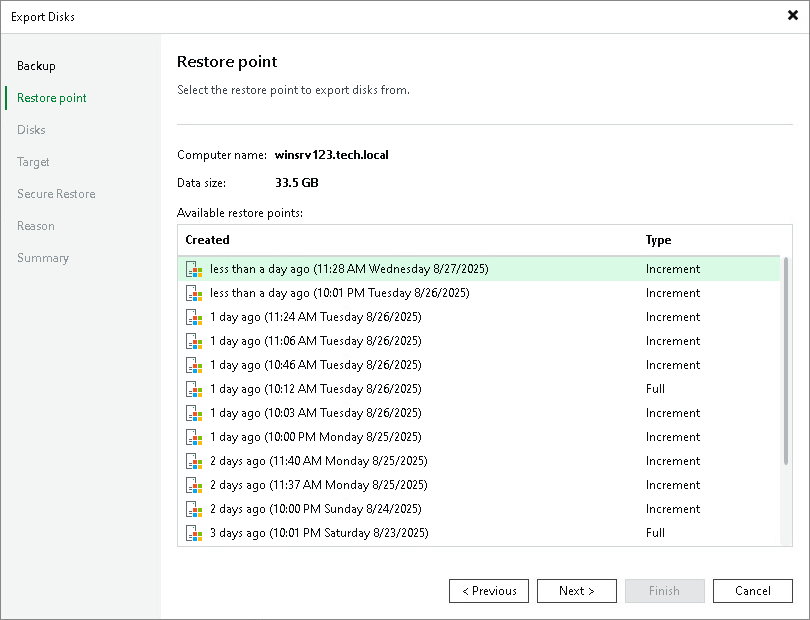

# Step 3. Select Restore Point

At the Restore Point step of the wizard, select the necessary restore point from which you want to restore disks. In the list of points, Veeam Backup & Replication displays all restore points that have been created. Make sure that you select a restore point that relates to the selected backup.

