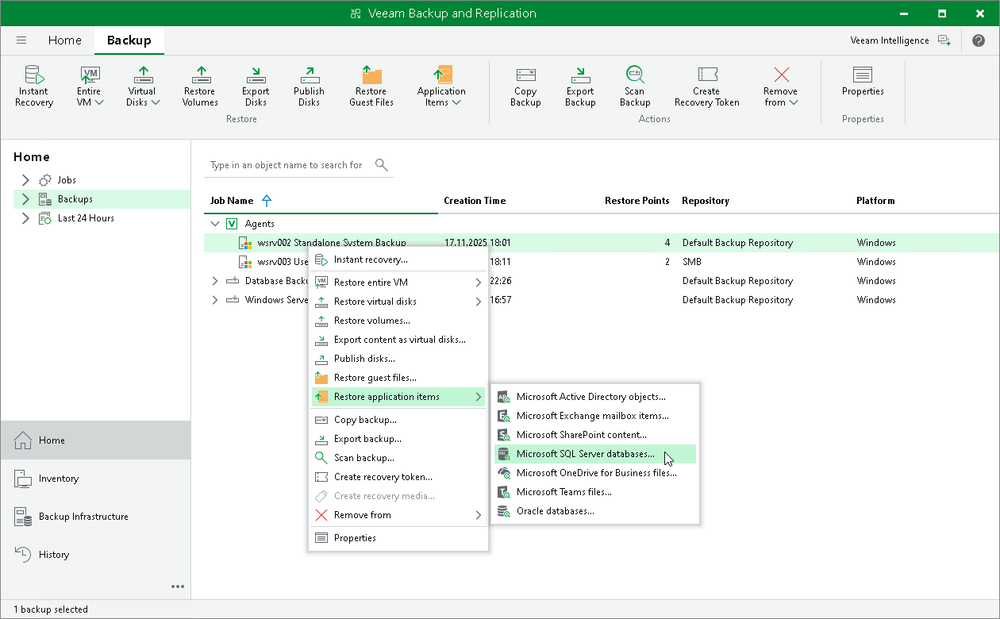

# Restoring Application Items

In this article

You can use Veeam Explorers to restore application items from backups created using Veeam Agent for Microsoft Windows and Veeam Agent for Linux. Veeam Backup & Replication lets you restore items and objects from the following applications:

From backups created with Veeam Agent for Microsoft Windows

* Microsoft Active Directory
* Microsoft Exchange
* Microsoft SharePoint
* Microsoft SQL Server
* Oracle

From backups created with Veeam Agent for Linux

* Oracle
* PostgreSQL

The procedure of application item restore from a Veeam Agent backup does not differ from the same procedure for a VM backup. To learn more, see [Application Item Restore](restore_veeam_explorers.md).

Page updated 11/19/2025

Page content applies to build 13.0.1.1071
