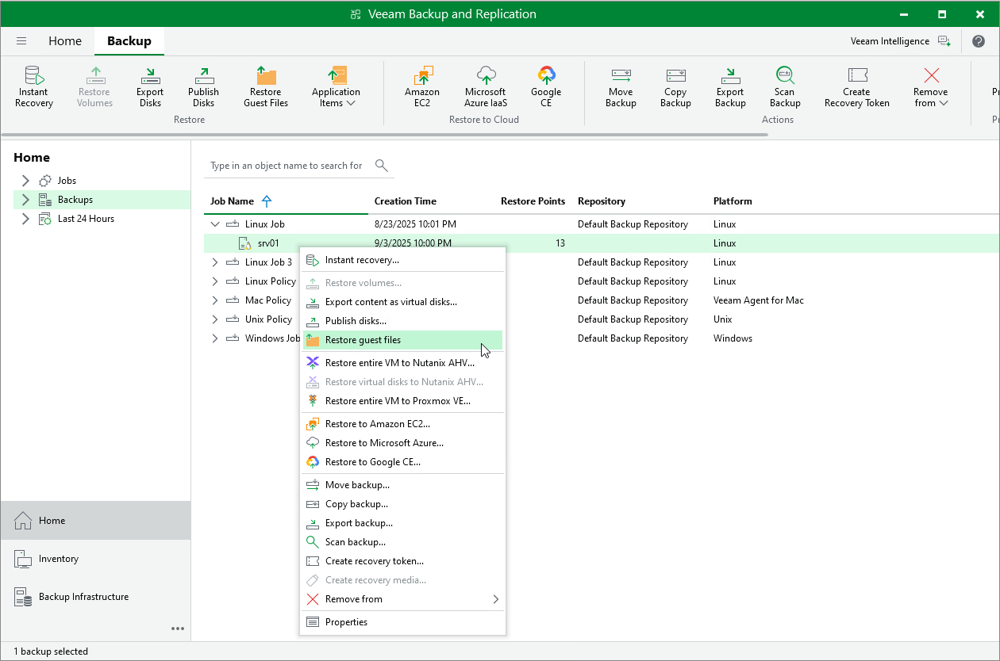

# Restoring Files and Folders

You can use the Veeam Backup & Replication console to restore individual files and folders from Veeam Agent backups.

The procedure of file-level restore from a Veeam Agent backup is similar to the same procedure for a VM backup. To learn more about file-level restore, see the [Guest OS File Restore](guest_file_recovery.md).

Consider the following:

* When you perform the file-level restore procedure, Veeam Backup & Replication selects a mount server automatically, based on the OS of the protected computer and infrastructure availability. You can also specify a preferred mount server manually. For more information, see [Mount Server Automatic Selection](guest_restore_scenarios.md).

* Veeam backup server.
* Helper host. You can use the following infrastructure components as helper hosts:

* Any Linux host with a [supported operating system](https://helpcenter.veeam.com/docs/vbr/userguide/system_requirements.html?ver=13#helper-host).
* [For backups of Microsoft Windows computers] In addition to Linux host, you can also choose to mount backup to a Microsoft Windows host.
* [For backups of Unix computers ] In addition to Linux host, you can also choose to mount backup to a Unix host.

|  |
| --- |
| Important |
| Unix-based helper hosts must not be deployed to a WPAR or non-global zone. |

* [For backups of Linux, Mac and Unix computers] Temporary helper appliance — a helper VM required to mount computer disks from the backup.

|  |
| --- |
| NOTE |
| [For VMSphere] If you have selected to mount backup to a temporary helper appliance, it is recommended that you add a vCenter Server and not a standalone ESXi host in the Veeam backup console. If Veeam Backup & Replication is set up to deploy a helper appliance on a standalone ESXi host, after Veeam Backup & Replication removes the helper appliance, the helper VM will be displayed in vCenter as orphaned. |

* [For backups of Linux and Unix computers] Original host — the protected computer.

|  |
| --- |
| Important |
| Veeam backup server must be able to resolve the domain name of the original host into IP address. |

* [For backups of Linux, Unix and Mac computers] For file-level restore, you can only use Veeam Agent backups stored in a Veeam backup repository.
* [For backups of Microsoft Windows and Linux computers] When you restore files to a new location, you cannot use the Browse button to select a folder where items will be restored. To specify the folder, enter the full path to the folder in the Target directory field.
* [For backups of Microsoft Windows computers] For file-level restore, you can only use Veeam Agent backups stored in a Veeam backup repository or Veeam Cloud Connect repository. For Veeam Agent backups created in the cloud repository, you can perform restore tasks in Veeam Backup & Replication deployed on the tenant backup server. The service provider cannot perform restore tasks with Veeam Agent backups.
* [For backups of Microsoft Windows computers] Before you start file-level restore from a backup of a failover cluster, make sure that the cluster is added to a protection group in the Veeam Backup & Replication inventory. The failover cluster may be not present in the inventory, for example, in the following cases:

* The original protection group that contained the cluster was removed from Veeam Backup & Replication.
* You want to restore cluster data from a backup created on another backup server and imported in the Veeam backup console.

In this case, add the failover cluster whose data you want to restore to a protection group.

* [For backups of Linux computers] If you restore data from a backup of a system with bind mount points, the backup will contain only the data from the original mount points. The bind mount points and the bind mount configuration of the original system will not be replicated in the backup. After restore, you may need to manually reconfigure any bind mounts that existed on the original system.

