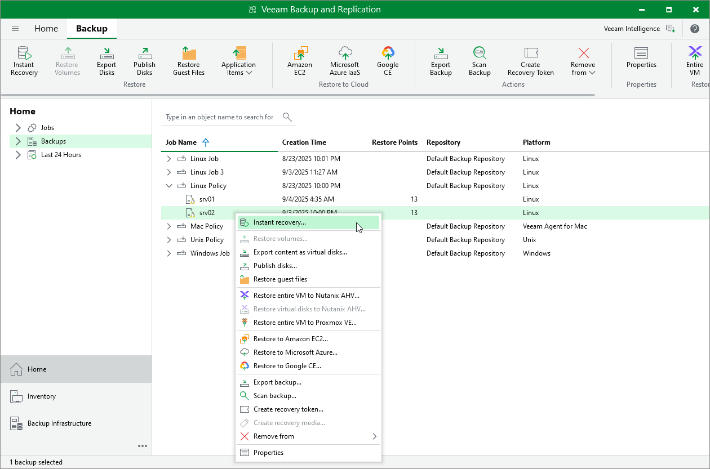

# Restoring Veeam Agent Backup to Hyper-V VM

In the Veeam Backup & Replication console, you can use Instant Recovery to restore a Veeam Agent computer as a Hyper-V VM in your virtualization environment.

A restored Hyper-V VM will have the same settings as the backed-up Veeam Agent computer. During the restore process, Veeam Backup & Replication retrieves settings of the Veeam Agent computer from the backup and applies them to the target VM.

Considerations and Limitations

If you restore a Veeam Agent computer to a Hyper-V VM, consider the following:

* You can use backups of Microsoft Windows and Linux computers stored in a Veeam backup repository only. You cannot use backups stored in a Veeam Cloud Connect repository for this operation.
* To restore to a Hyper-V VM from a backup of a Linux computer, you must consider the Hyper-V limitations. To learn more, see [this Microsoft article](https://docs.microsoft.com/en-us/windows-server/virtualization/hyper-v/supported-linux-and-freebsd-virtual-machines-for-hyper-v-on-windows).

* Make sure that the target host has enough resources for a new VM. Otherwise, your VM will reduce the target host performance.

* Veeam Agent computer disks are recovered as dynamically expanding virtual disks.
* By default, Veeam Backup & Replication automatically powers on a VM after restore. If you do not want to power on a VM after restore, you can change this setting during the Instant Recovery configuration process.

* [For Linux-based computers] If the disk you want to restore contains a Btrfs storage pool, during the restore process, Veeam Backup & Replication will create a separate disk and restore the Btrfs pool to this disk.

* [For Linux-based computers] If the disk you want to restore contains a Logical Volume Manager (LVM) volume group, consider the following:

* Since LVM volume group is a logical entity that spans across the physical disks, Veeam Agent treats the original disk and the LVM volume group as separate entities. Therefore, Veeam Backup & Replication will restore the original disk and the LVM volume group as 2 separate disks. This way, all data, including the data within the LVM volume group, is accurately restored.
* Restoring the original disk and the LVM volume groups as 2 separate disks requires an increased amount of storage space. For example, you restore a machine with 2 disks, and a separate LVM volume group is configured on each of these disks. In this case, Veeam Backup & Replication will restore 4 disks. The restored disks will consume the storage space equal to the size of the 2 original disks and the 2 LVM volume groups from these disks.

|  |
| --- |
| TIP |
| After restore, you can remove unnecessary disks from the machine. To learn more, see [this Veeam KB article](https://www.veeam.com/kb4680). |

Restore to Hyper-V VM

The procedure of Instant Recovery for a Veeam Agent computer practically does not differ from the same procedure for a VM. The main difference from Instant Recovery is that you do not need to select the recovery mode, because Veeam Agent computers are always restored to a new location. To learn more, see [Performing Instant Recovery of Workloads to Hyper-V](performing_instant_recovery_hv_vm.md).

