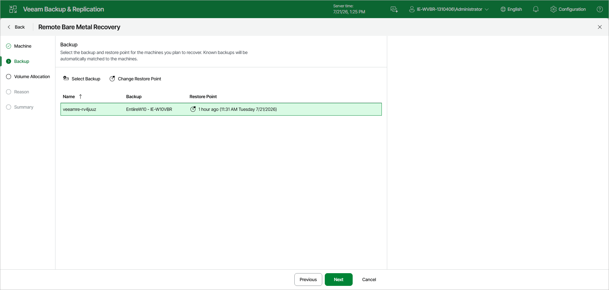

# Step 3. Select Backup and Restore Point

At the Backup step of the wizard, select the backup and restore point for each recovery appliance. Veeam Backup & Replication automatically matches known backups to the recovery appliances by host name and displays the matched backup and the most recent restore point in the list.

* To use a different backup, select the recovery appliance in the list and click Select Backup. In the Backup Browser window, expand the necessary backup, select the required machine and click Add.
* To use a different restore point of the selected backup, select the recovery appliance in the list and click Change Restore Point. In the Restore Points window, select the necessary restore point and click OK.

Page updated 2026-07-21

